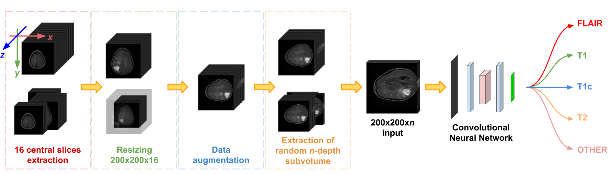

# Deep Learning-based Type Identification of Volumetric MRI Sequences
[Jean Pablo Vieira de Mello](https://github.com/Jpvmello), [Thiago M. Paixão](https://sites.google.com/view/thiagopx), [Rodrigo F. Berriel](http://rodrigoberriel.com/), [Mauricio Reyes](http://www.mauricioreyes.me/aboutme.html), [Claudine Badue](https://www.inf.ufes.br/~claudine/), [Alberto F. De Souza](https://inf.ufes.br/~alberto) and [Thiago Oliveira-Santos](https://www.inf.ufes.br/~todsantos/home)

Source code and trained models referring to the paper **Deep Learning-based Type Identification of Volumetric MRI Sequences**, published in [ICPR 2020](https://www.micc.unifi.it/icpr2020/) are available here.

DOI: [10.1109/ICPR48806.2021.9413120] (https://doi.org/10.1109/ICPR48806.2021.9413120)
arXiv: [https://arxiv.org/abs/2106.03208] (https://arxiv.org/abs/2106.03208)

***Note:*** _after the acceptance of the work, it was noticed that some experiments may be biased, as different versions of the BraTS dataset present some data overlap (repeated data among them). [This document] (https://docs.google.com/document/d/1UmE7jFfWaAxsS6wXodPRkdKeyDAcVdEWXfMKGzGiiKk/edit?usp=sharing) aims to correct this, presenting some unbiased experiments._



### Abstract

The analysis of Magnetic Resonance Imaging (MRI) sequences enables clinical professionals to monitor the progression of a brain tumor. As the interest for automatizing brain volume MRI analysis increases, it becomes convenient to have each sequence well identified. However, the unstandardized naming of MRI sequences makes their identification difficult for automated systems, as well as makes it difficult for researches to generate or use datasets for machine learning research. In the face of that, we propose a system for identifying types of brain MRI sequences based on deep learning. By training a Convolutional Neural Network (CNN) based on 18-layer ResNet architecture, our system can classify a volumetric brain MRI as a FLAIR, T1, T1c or T2 sequence, or whether it does not belong to any of these classes. The network was evaluated on publicly available datasets comprising both, pre-processed (BraTS dataset) and non-pre-processed (TCGA-GBM dataset), image types with diverse acquisition protocols, requiring only a few slices of the volume for training. Our system can classify among sequence types with an accuracy of 96.81%.

## Generating dataset

Use the script `generate_dataset.py` to assemble the final dataset from base MRI datasets, combining the following input arguments:

```
<datasets_path>             CSV file listing base datasets
[-tr]                       Percentage of data to be designated for train. Default: 70
[-ts]                       Percentage of data to be designated for test. Default: 20
[-v]                        Percentage of data to be designated for validation. Default: 10
[--balance]                 If provided, data is oversampled so that the final dataset contains the same number of samples of each class
```

The CSV file listing the base datasets must be in format `path,extension,n_flair,n_t1,n_t1c,n_t2,n_other`, where:

```
path        Path to the dataset volumes from a directory named 'data' inside the root directory.
extension   File extension (without preceding dot) of the volumes contained in *path*
n_flair     Number of FLAIR samples. For all samples, use -1
n_t1        Number of T1 samples. For all samples, use -1
n_t1c       Number of T1c samples. For all samples, use -1
n_t2        Number of T2 samples. For all samples, use -1
n_other     Number of OTHER samples. For all samples, use -1
```

This script outputs three CSV files containing the respective paths and labels of the volumes designated to train, validation and test inside ```data_csv/generated/```. The files used in the paper experiments are provided in this repository.

## Training and validation

Use ```train_val.py``` to train and validate your model, combining the following arguments:

```
-t              Path containing the training data CSV file
-v              Path containing the validation data CSV file
-m              Name of the output trained model file. The file will be generated inside 'models' directory
[-bs]           Number of samples per batch. Default: 1
[-lr]           Learning rate. Default: 0.001
[-ep]           Number of training epochs. Default: 70
[-sl]           Number of central slices to be considered. Default: 10
[--no-other]    If specified, OTHER class is not considered
[--net]         Network architecture to be used, among ['resnet18', 'alexnet', 'vgg', 'squeezenet', 'mobilenet']
[-w]            Weight decay. Default: 0
[-3d]           If specified along *--net resnet18*, performs ResNet18 3D convolution
```

## Test

Use ```test.py``` to test your model, combining the following arguments:

```
-t              Path containing the test data CSV file
-m              Name of the output trained model file inside the 'models' directory
[-sl]           Number of central slices used for training. Default: 10
[--no-other]    If specified, declares that OTHER class was not considered for training
[--net]         Network architecture used, among ['resnet18', 'alexnet', 'vgg', 'squeezenet', 'mobilenet']
[-3d]           If specified along *--net resnet18*, declares that ResNet18 3D convolution was performed
```

## Trained models

The trained models described in the paper are available [here](https://drive.google.com/drive/folders/1h6fgWXEUxQaFFM72XvaUMLw0ExR-6dFU?usp=sharing). Prefixes ```bX```, ```tX``` and ```btX``` denote models trained considering X classes with BRATS data, TCGA-GBM data and mixed data, respectively. Prefix ```main``` denotes models trained with the main dataset, BRATS+TCGA5. Suffixes ```slX.pth``` denote models trained with X central slices.
